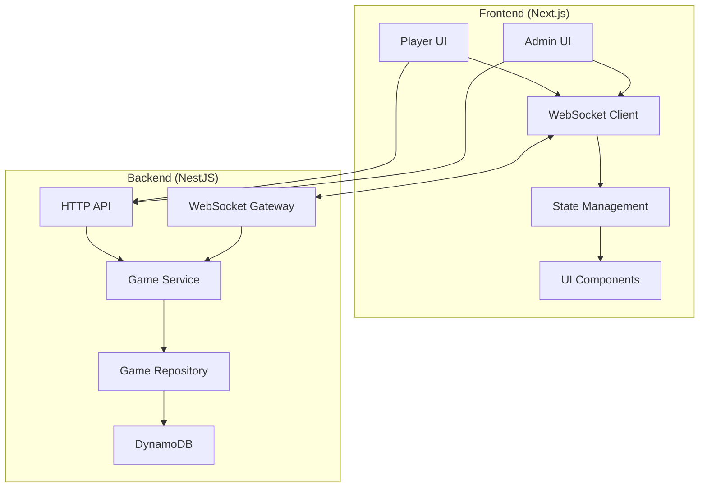

# Design Document: Bingo Web App

## Overview

The Bingo Web App is a real-time, mobile-first web application that enables up to 100 concurrent players to participate in bingo games managed by 1-2 administrators. The system is designed to provide a seamless, low-friction experience with real-time updates, automatic reconnection, and intuitive interfaces for both players and administrators.

This document outlines the technical design of the application, including architecture, components, data models, and implementation strategies to meet the requirements specified in the requirements document.

## Architecture

The application follows a client-server architecture with real-time communication capabilities:

### High-Level Architecture



### Key Components

1. **Frontend (Next.js)**
   - React components for Player and Admin UIs
   - WebSocket client for real-time updates
   - Client-side state management
   - Responsive design with TailwindCSS

2. **Backend (NestJS)**
   - RESTful API for game management
   - WebSocket Gateway for real-time communication
   - Game service for business logic
   - DynamoDB integration for persistence

3. **Infrastructure (AWS)**
   - AWS Amplify for deployment
   - AWS Lambda for serverless backend
   - DynamoDB for data storage with TTL
   - CloudFront for content delivery

## Components and Interfaces

### Frontend Components

#### Player Interface

1. **Game Join Component**
   - QR code scanner
   - Manual game code entry
   - Name input form

2. **Bingo Card Component**
   - 5×5 grid of numbers
   - Tap-to-punch interaction
   - Visual indicators for called numbers
   - Bingo status indicator

3. **Game Status Component**
   - Recently called numbers display
   - Game state indicator (active, paused, ended)
   - Connection status indicator

#### Admin Interface

1. **Game Creation Component**
   - Game settings configuration
   - QR code and game code display
   - Game duration settings

2. **Number Drawing Component**
   - Manual draw button
   - Automatic draw configuration
   - Previously drawn numbers display

3. **Player Monitoring Component**
   - Participant list with online status
   - Bingo status tracking
   - Game statistics dashboard

### Backend Components

#### API Controllers

1. **Game Controller**
   - Endpoints for game CRUD operations
   - Player registration
   - Game state management

2. **Admin Controller**
   - Authentication and authorization
   - Game configuration
   - Administrative actions

#### WebSocket Gateway

1. **Game Gateway**
   - Real-time number broadcasting
   - Player connection management
   - Game state synchronization

#### Services

1. **Game Service**
   - Game logic implementation
   - Bingo validation
   - Number generation and tracking

2. **Player Service**
   - Player management
   - Card generation
   - Connection tracking

#### Repositories

1. **Game Repository**
   - Game data persistence
   - Query operations
   - TTL management for game cleanup

2. **Player Repository**
   - Player data persistence
   - Card state management
   - Connection state tracking

## Data Models

### Game

```typescript
interface Game {
  id: string;                  // Unique identifier
  code: string;                // Short code for joining
  status: GameStatus;          // 'created', 'active', 'paused', 'ended'
  createdAt: Date;             // Creation timestamp
  startedAt?: Date;            // Game start timestamp
  endedAt?: Date;              // Game end timestamp
  expiresAt: Date;             // TTL for DynamoDB (max 12 hours)
  drawMode: DrawMode;          // 'manual' or 'timed'
  drawInterval?: number;       // Interval in seconds for timed mode
  drawnNumbers: number[];      // Numbers that have been called
  lastDrawnAt?: Date;          // Timestamp of last number draw
  playerCount: number;         // Number of registered players
  activePlayerCount: number;   // Number of currently connected players
  bingoCount: number;          // Number of players who have reached bingo
  adminConnections: string[];  // Admin connection IDs
}

enum GameStatus {
  CREATED = 'created',
  ACTIVE = 'active',
  PAUSED = 'paused',
  ENDED = 'ended'
}

enum DrawMode {
  MANUAL = 'manual',
  TIMED = 'timed'
}
```

### Player

```typescript
interface Player {
  id: string;                  // Unique identifier
  gameId: string;              // Reference to game
  name: string;                // Player name
  card: BingoCard;             // Player's bingo card
  punchedNumbers: number[];    // Numbers punched by player
  hasBingo: boolean;           // Whether player has bingo
  bingoAchievedAt?: Date;      // When bingo was achieved
  connectionId?: string;       // Current WebSocket connection ID
  isOnline: boolean;           // Connection status
  lastSeenAt: Date;            // Last activity timestamp
}

interface BingoCard {
  grid: number[][];            // 5x5 grid of numbers
  freeSpace?: {row: number, col: number}; // Optional free space position
}
```

### WebSocket Messages

```typescript
interface WebSocketMessage {
  type: MessageType;
  payload: any;
  timestamp: Date;
}

enum MessageType {
  // Game state messages
  GAME_STATE_UPDATE = 'game_state_update',
  NUMBER_DRAWN = 'number_drawn',
  GAME_PAUSED = 'game_paused',
  GAME_RESUMED = 'game_resumed',
  GAME_ENDED = 'game_ended',
  
  // Player messages
  PLAYER_JOINED = 'player_joined',
  PLAYER_LEFT = 'player_left',
  PLAYER_STATUS_CHANGE = 'player_status_change',
  PLAYER_PUNCHED_NUMBER = 'player_punched_number',
  PLAYER_UNPUNCHED_NUMBER = 'player_unpunched_number',
  PLAYER_BINGO = 'player_bingo',
  
  // Connection messages
  CONNECT = 'connect',
  DISCONNECT = 'disconnect',
  RECONNECT = 'reconnect',
  SYNC_REQUEST = 'sync_request',
  SYNC_RESPONSE = 'sync_response',
  
  // Error messages
  ERROR = 'error'
}
```

## Error Handling

### Frontend Error Handling

1. **Connection Errors**
   - Automatic reconnection attempts with exponential backoff
   - Visual indicators for connection status
   - Offline mode with local state preservation

2. **Input Validation**
   - Client-side validation for all user inputs
   - Clear error messages for invalid inputs
   - Form state preservation during validation errors

3. **State Synchronization**
   - Periodic state verification with server
   - Conflict resolution strategies
   - Graceful degradation when synchronization fails

### Backend Error Handling

1. **API Error Responses**
   - Consistent error response format
   - Appropriate HTTP status codes
   - Detailed error messages for debugging

2. **WebSocket Error Handling**
   - Connection monitoring and cleanup
   - Message acknowledgment system
   - Reconnection handling

3. **Database Error Handling**
   - Retry mechanisms for transient failures
   - Fallback strategies for data access
   - Data integrity validation

### Global Error Strategy

1. **Logging and Monitoring**
   - Structured error logging
   - Error aggregation and alerting
   - Performance monitoring

2. **Graceful Degradation**
   - Feature-specific fallbacks
   - Progressive enhancement approach
   - Critical path prioritization

## Testing Strategy

### Frontend Testing

1. **Unit Tests**
   - Component rendering tests
   - State management tests
   - Utility function tests

2. **Integration Tests**
   - User flow tests
   - WebSocket communication tests
   - Form submission and validation tests

3. **End-to-End Tests**
   - Complete user journeys
   - Cross-browser compatibility
   - Responsive design tests

### Backend Testing

1. **Unit Tests**
   - Service logic tests
   - Repository method tests
   - Utility function tests

2. **Integration Tests**
   - API endpoint tests
   - WebSocket gateway tests
   - Database interaction tests

3. **End-to-End Tests**
   - Complete API flow tests
   - WebSocket communication tests
   - Game logic tests

### Performance Testing

1. **Load Testing**
   - Concurrent user simulation
   - WebSocket connection limits
   - API request throughput

2. **Latency Testing**
   - Message propagation time measurement
   - Response time under various loads
   - Network condition simulation

3. **Scalability Testing**
   - Resource utilization monitoring
   - Auto-scaling trigger verification
   - Maximum capacity determination

## Security Considerations

1. **Input Validation**
   - All user inputs validated server-side
   - Protection against injection attacks
   - Rate limiting for API and WebSocket messages

2. **Authentication and Authorization**
   - Admin authentication system
   - Game access control via game codes
   - WebSocket connection authentication

3. **Data Protection**
   - No sensitive personal data collection
   - Data minimization approach
   - Automatic data cleanup via TTL

## Implementation Approach

The implementation will follow an incremental approach:

1. **Foundation Phase**
   - Basic project setup (Next.js, NestJS, AWS)
   - Core data models and interfaces
   - Basic API endpoints

2. **Core Functionality Phase**
   - Game creation and management
   - Player registration and card generation
   - Basic WebSocket communication

3. **Real-time Features Phase**
   - Number drawing and broadcasting
   - Card interaction and state management
   - Connection handling and synchronization

4. **Admin Features Phase**
   - Admin dashboard implementation
   - Player monitoring
   - Game statistics

5. **Optimization Phase**
   - Performance tuning
   - Error handling improvements
   - User experience enhancements

Each phase will include appropriate testing to ensure the system meets the requirements specified in the requirements document.